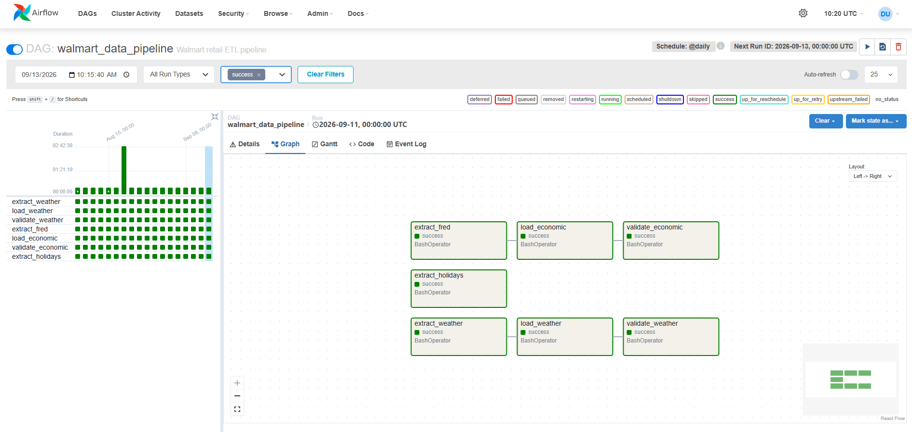
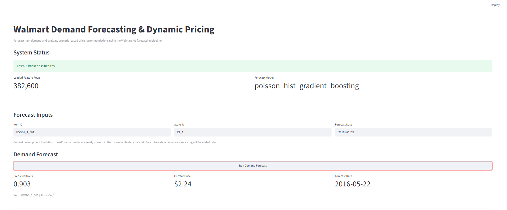
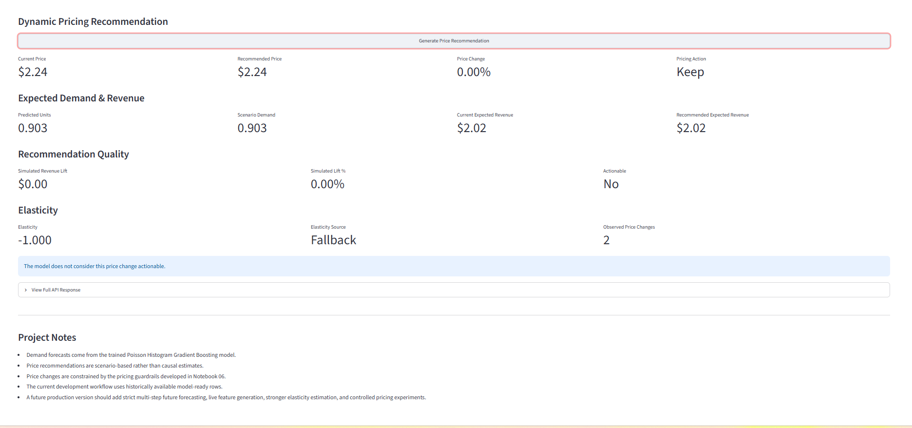

# Walmart Enterprise Demand Forecasting & Dynamic Pricing

An end-to-end data science and machine learning project that simulates an enterprise retail forecasting and pricing system using Walmart's M5 dataset.

The project builds a complete pipeline from raw data ingestion and validation through feature engineering, demand forecasting, dynamic pricing recommendations, API serving, dashboarding, workflow orchestration, testing, and Dockerized deployment.

---

## Project Overview

Retailers need to answer two closely related questions:

1. **How much demand should we expect for a product?**
2. **What price should we recommend given that expected demand?**

This project develops an end-to-end system for addressing both problems.

The system combines historical Walmart sales and pricing data with calendar, holiday, weather, and economic information to create model-ready features.

A machine learning model predicts product demand, while a separate pricing engine evaluates controlled price scenarios and recommends whether a product's price should be increased, decreased, or kept unchanged.

The final system exposes predictions through a **FastAPI backend** and an interactive **Streamlit dashboard**, while **PostgreSQL, Apache Airflow, Docker, and Pytest** support the surrounding data and application infrastructure.

---

## Key Results

### Demand Forecasting

The selected **Poisson Histogram Gradient Boosting** model achieved the following performance on the final held-out test period:

| Model | MAE | RMSE |
|---|---:|---:|
| **Poisson Histogram Gradient Boosting** | **1.252** | **2.206** |
| 28-Day Naive Baseline | 1.583 | 2.859 |
| 7-Day Naive Baseline | 1.630 | 2.924 |

Compared with the 7-day naive baseline, the selected model improved:

- **MAE by 23.17%**
- **RMSE by 24.54%**

The evaluation workflow also includes rolling-origin backtesting to test whether the model continues to outperform naive forecasting approaches across multiple historical windows.

### Dynamic Pricing

The project includes two pricing scopes:

**Notebook 06 evaluation scope**

Notebook 06 evaluates the pricing logic on the held-out test-period predictions.

```text
Pricing-eligible rows: 5,600

Current expected revenue:
$22,081.75

Recommended expected revenue:
$23,200.21

Simulated expected revenue lift:
$1,118.46

Simulated expected revenue lift:
5.07%
```

**Production pricing pipeline scope**

The reusable production pricing module later generates recommendations across the broader eligible feature dataset.

```text
Pricing recommendations: 326,838

Decrease: 28.24%
Keep:     68.39%
Increase:  3.37%

Actionable recommendations: 101,392
Actionable rate: 31.02%

Observed elasticity: 103,305
Fallback elasticity: 223,533

Current expected revenue:
$1,202,032.22

Recommended expected revenue:
$1,264,768.32

Simulated expected revenue lift:
$62,736.10

Simulated expected revenue lift:
5.22%
```

These two sets of numbers represent **different evaluation scopes** and should not be compared as though they came from the same dataset.

> **Important:** All pricing results are scenario-model outputs. They are not experimentally verified causal revenue gains or realized Walmart business results.

---

## System Architecture

```text
                    RAW DATA SOURCES
                           │
        ┌──────────────────┼──────────────────┐
        │                  │                  │
   Walmart M5          Weather API          FRED
 Sales / Prices        Open-Meteo       Economic Data
        │                  │                  │
        └──────────────────┼──────────────────┘
                           │
                           ▼
                    ETL PIPELINE
             Extract → Validate → Load
                           │
                           ▼
                      PostgreSQL
                           │
                           ▼
                  Feature Engineering
                           │
                           ▼
                  Forecasting Model
                           │
                           ▼
                  Demand Predictions
                           │
                           ▼
                  Dynamic Pricing Engine
                           │
                           ▼
                       FastAPI
                           │
                           ▼
                      Streamlit
                           │
                           ▼
                 Interactive Dashboard


        Airflow → Pipeline Orchestration
        Docker  → Containerized Environment
        Pytest  → API Smoke Testing
```

---

## Technology Stack

| Area | Technology |
|---|---|
| Programming | Python |
| Data Processing | Pandas, NumPy |
| Machine Learning | Scikit-learn |
| Database | PostgreSQL |
| ORM / Database Access | SQLAlchemy |
| Workflow Orchestration | Apache Airflow |
| API | FastAPI |
| Dashboard | Streamlit |
| Containerization | Docker / Docker Compose |
| Testing | Pytest |
| External Data | Open-Meteo, FRED, U.S. Holidays |

---

## Data Sources

### Walmart M5 Forecasting Dataset

The core retail data comes from Walmart's M5 forecasting dataset.

It contains:

- Historical unit sales
- Product hierarchy
- Store information
- Historical selling prices
- Calendar information
- Events and holidays

The project primarily works with the following files:

```text
calendar.csv
sell_prices.csv
sales_train_validation.csv
sales_train_evaluation.csv
```

### Weather Data

Historical weather data is collected using Open-Meteo for the states represented in the M5 dataset:

```text
California
Texas
Wisconsin
```

### Economic Data

Economic indicators are collected from the Federal Reserve Economic Data (FRED) API.

The project includes:

```text
CPIAUCSL   → Consumer Price Index
UNRATE     → Unemployment Rate
FEDFUNDS   → Federal Funds Rate
```

### Holiday Data

U.S. holiday information is incorporated to help capture demand changes around important calendar events.

---

## ETL Pipeline

The ETL layer extracts external and local data, validates it, and prepares it for downstream analysis.

```text
Extract
   ↓
Validate
   ↓
Load
   ↓
PostgreSQL
```

The project includes separate processes for:

- Walmart sales
- Product prices
- Calendar information
- Weather
- Economic indicators
- Holidays

Data-quality checks are performed before downstream modeling.

Examples include:

- Null key checks
- Duplicate checks
- Date validation
- Schema validation
- Dimension integrity checks
- Invalid-value checks

---

## PostgreSQL Data Warehouse

PostgreSQL provides the structured storage layer for the project.

The warehouse includes dimension and fact tables such as:

```text
dim_product
dim_store
dim_calendar
dim_economic_series

fact_sales
fact_prices
fact_weather
```

This separates structured data storage from the machine learning layer and better represents how data can be managed in a production-oriented analytics environment.

---

## Apache Airflow

Apache Airflow is used to orchestrate the project's ETL pipeline.

Airflow provides:

- Task scheduling
- Dependency management
- Pipeline monitoring
- Repeatable ETL execution
- Failure visibility
- Data validation sequencing

The Airflow scheduler and webserver run as separate Docker services.

---

## Notebook Workflow

The analysis is organized into six notebooks that follow the data science lifecycle.

```text
01 Data Profiling
      ↓
02 Exploratory Data Analysis
      ↓
03 Feature Engineering
      ↓
04 Modeling
      ↓
05 Model Evaluation
      ↓
06 Dynamic Pricing
```

### Notebook 01 — Data Profiling

Focuses on understanding the raw datasets before analysis.

Includes:

- Data sources
- Shapes and schemas
- Missing values
- Duplicate checks
- Key fields
- Date ranges
- Memory usage
- Basic validity checks

### Notebook 02 — Exploratory Data Analysis

Investigates business and demand behavior.

Includes:

- Overall demand trends
- Day-of-week seasonality
- Monthly and yearly patterns
- Store behavior
- Category and department behavior
- Price relationships
- Holiday and event effects
- SNAP behavior
- Weather and economic relationships

### Notebook 03 — Feature Engineering

Creates the model-ready feature dataset.

Includes:

- Time features
- Lag features
- Rolling features
- Price features
- Calendar/event features
- Weather features
- Economic features
- Leakage checks

### Notebook 04 — Modeling

Builds and compares forecasting approaches.

Includes:

- Chronological train/validation/test split
- Naive forecasting baselines
- Histogram Gradient Boosting
- Poisson Histogram Gradient Boosting
- Validation-based model selection
- Final test evaluation
- Final model refitting and saving

### Notebook 05 — Model Evaluation

Performs deeper evaluation before the forecasting system feeds the pricing engine.

Includes:

- Final test metrics
- Baseline comparison
- Bias analysis
- Product-level errors
- Store/category segmentation
- Rolling-origin backtesting
- Feature importance
- Model acceptance checks

### Notebook 06 — Dynamic Pricing

Uses demand predictions to simulate guarded pricing scenarios.

Includes:

- Price elasticity estimation
- Observed versus fallback elasticity
- Candidate price scenarios
- Price-change guardrails
- Expected demand simulation
- Expected revenue simulation
- Actionability thresholds
- Business limitations and assumptions

---

## Exploratory Data Analysis

The exploratory workflow investigates the major components of the retail dataset before modeling.

Analysis includes:

- Sales distributions
- Product and category behavior
- Store-level demand
- Missing values
- Price behavior
- Calendar effects
- Event and holiday effects
- Time-series patterns
- Weather relationships
- Economic relationships

The notebooks progressively move from understanding the raw data toward feature engineering, forecasting, model evaluation, and pricing analysis.

---

## Feature Engineering

Historical sales and external information are transformed into model-ready features.

### Time Features

Examples include:

```text
day of week
month
year
week
weekend indicators
```

### Lag Features

Historical demand values are shifted backward to provide the model with information about previous sales behavior.

Examples include:

```text
lag_7
lag_28
```

### Rolling Features

Rolling statistics summarize recent demand behavior.

Examples include rolling averages and recent zero-sales behavior.

### Calendar Features

Features incorporate information such as:

- Events
- Holidays
- SNAP information
- Calendar structure

### Price Features

The pipeline incorporates current and historical pricing information for downstream forecasting and pricing analysis.

### External Features

The feature pipeline can also incorporate:

- Weather
- CPI
- Unemployment
- Federal funds rate

The resulting model-ready feature dataset is used by the forecasting pipeline.

---

## Demand Forecasting

The forecasting component predicts expected unit demand at the product/store/date level.

The final forecasting workflow uses a **Poisson Histogram Gradient Boosting** model designed for non-negative, count-like demand data.

The model learns relationships between historical demand and features such as:

```text
Historical sales
Lagged demand
Rolling demand
Price
Calendar information
Events
Holidays
Weather
Economic variables
```

Predictions are constrained to prevent negative demand forecasts.

---

## Model Evaluation

Forecasting performance is evaluated using chronological validation rather than randomly mixing past and future observations.

Primary evaluation metrics include:

### MAE — Mean Absolute Error

Measures the average absolute difference between predicted demand and actual demand.

Lower is better.

### RMSE — Root Mean Squared Error

Measures prediction error while penalizing larger mistakes more heavily than MAE.

Lower is better.

### Final Holdout Performance

| Model | MAE | RMSE |
|---|---:|---:|
| **Poisson Histogram Gradient Boosting** | **1.252** | **2.206** |
| 28-Day Naive Baseline | 1.583 | 2.859 |
| 7-Day Naive Baseline | 1.630 | 2.924 |

The selected model improved:

- **MAE by 23.17%** versus the 7-day naive baseline
- **RMSE by 24.54%** versus the 7-day naive baseline

The model evaluation notebook also includes rolling-origin backtesting to test performance across multiple historical windows rather than relying on a single holdout period.

---

## Dynamic Pricing Engine

Demand predictions are passed into a scenario-based pricing engine.

The pricing system evaluates controlled price changes and estimates their effect on expected demand and expected revenue.

For each eligible product/date combination, the system can recommend:

```text
Increase
Decrease
Keep
```

The engine includes pricing guardrails to prevent unrealistic recommendations.

It distinguishes between:

```text
Observed elasticity
Fallback elasticity
```

When historical evidence is insufficient for reliable item-level elasticity estimation, the system uses a fallback assumption rather than pretending the observed relationship is precise.

Candidate prices are evaluated within constrained price ranges, and recommendations must meet minimum simulated revenue-improvement requirements before being considered actionable.

The system also prefers keeping the current price when multiple candidate prices generate effectively equivalent simulated revenue.

---

## FastAPI Backend

FastAPI exposes the forecasting and pricing functionality through an API.

The API includes endpoints for:

```text
GET  /health
POST /forecast
POST /recommend-price
```

Application flow:

```text
Client
   ↓
FastAPI
   ↓
Forecasting Model
   ↓
Pricing Engine
   ↓
JSON Response
```

Interactive API documentation is available locally at:

```text
http://localhost:8000/docs
```

---

## Streamlit Dashboard

The Streamlit application provides a user-friendly interface for interacting with the system.

Users can select:

```text
Item
Store
Date
```

and request a demand forecast or pricing recommendation.

The dashboard displays information such as:

- Predicted demand
- Current price
- Recommended price
- Pricing action
- Expected demand
- Current expected revenue
- Recommended expected revenue
- Simulated revenue lift
- Elasticity
- Elasticity source
- Recommendation status

The local dashboard runs at:

```text
http://localhost:8501
```

---

## Project Demonstration

### Airflow ETL Pipeline

Apache Airflow orchestrates the extraction, loading, and validation of external data sources used by the forecasting pipeline.



### Demand Forecasting Application

The Streamlit application communicates with the FastAPI backend to generate item-level demand predictions using the trained Poisson Histogram Gradient Boosting model.



### Dynamic Pricing Recommendation

The pricing engine evaluates forecasted demand, current price, price elasticity, expected revenue, and pricing guardrails before recommending a pricing action.



---

## Docker Architecture

The project is containerized with Docker Compose.

The primary services are:

```text
PostgreSQL
Airflow Init
Airflow Scheduler
Airflow Webserver
FastAPI
Streamlit
```

Conceptually:

```text
┌─────────────────────┐
│      Streamlit      │
│       :8501         │
└──────────┬──────────┘
           │
           ▼
┌─────────────────────┐
│       FastAPI       │
│        :8000        │
└─────────────────────┘

┌─────────────────────┐
│      PostgreSQL     │
│   Host port :5433   │
└─────────────────────┘

┌─────────────────────┐
│       Airflow       │
│        :8080        │
└─────────────────────┘
```

Docker provides a reproducible environment for running the project's infrastructure and application services.

---

## Running the Project

### 1. Clone the Repository

```bash
git clone https://github.com/dennyhoang8/walmart-enterprise-demand-forecasting.git
cd walmart-enterprise-demand-forecasting
```

### 2. Configure Environment Variables

Copy `.env.example` to a local `.env` file and provide the required values.

Example:

```text
POSTGRES_USER=postgres
POSTGRES_PASSWORD=your_password_here
POSTGRES_DB=walmart_forecasting
FRED_API_KEY=your_fred_api_key_here
```

The real `.env` file is excluded from Git and should never be committed.

### 3. Prepare Required Data and Model Artifacts

Large raw datasets, processed feature files, generated outputs, and trained model binaries are intentionally excluded from GitHub.

The local application may require generated artifacts such as:

```text
data/processed/features_CA_1_200_items.csv
models/demand_forecast_model.joblib
```

These artifacts are produced locally through the project's data preparation and modeling workflow.

### 4. Install Python Dependencies

For local development:

```bash
pip install -r requirements.txt
```

### 5. Build and Start Docker

```bash
docker compose up -d --build
```

### 6. Verify Containers

```bash
docker compose ps
```

Expected running services include:

```text
walmart_postgres
walmart_airflow_scheduler
walmart_airflow_webserver
walmart_api
walmart_streamlit
```

`airflow-init` may complete its initialization work and exit rather than remaining as a persistent service.

### 7. Open the Applications

```text
Streamlit:
http://localhost:8501

FastAPI:
http://localhost:8000/docs

Airflow:
http://localhost:8080
```

### 8. Stop the Environment

```bash
docker compose down
```

The PostgreSQL Docker volume persists unless it is explicitly removed.

Avoid:

```bash
docker compose down -v
```

unless the intention is to remove the persistent PostgreSQL volume as well.

---

## Automated Testing

The project includes API smoke tests using Pytest.

Tests verify functionality such as:

- API health
- Demand forecast requests
- Pricing recommendations
- Invalid or unavailable forecasting requests

Run tests with:

```bash
python -m pytest tests/test_api_smoke.py -v
```

---

## Project Structure

```text
walmart-enterprise-demand-forecasting/
│
├── airflow/
│   └── dags/
│
├── data/
│   ├── raw/
│   ├── external/
│   └── processed/
│
├── database/
│   ├── create_tables.sql
│   ├── validate_dimensions.sql
│   └── validate_schema.sql
│
├── docker/
│   ├── Dockerfile.airflow
│   ├── Dockerfile.api
│   └── Dockerfile.streamlit
│
├── docs/
│   └── images/
│       ├── airflow_pipeline.png
│       ├── streamlit_forecast.png
│       └── streamlit_pricing.png
│
├── etl/
│   ├── extract/
│   ├── load/
│   └── quality/
│
├── models/
│   └── demand_forecast_model_metadata.json
│
├── notebooks/
│   ├── 01_data_profiling.ipynb
│   ├── 02_exploratory_data_analysis.ipynb
│   ├── 03_feature_engineering.ipynb
│   ├── 04_modeling.ipynb
│   ├── 05_model_evaluation.ipynb
│   └── 06_dynamic_pricing_finalized.ipynb
│
├── outputs/
│   ├── evaluation/
│   ├── forecasting/
│   ├── modeling/
│   └── pricing/
│
├── sql/
│   └── business_analysis.sql
│
├── src/
│   ├── api/
│   │   └── main.py
│   ├── dashboard/
│   │   └── app.py
│   ├── features/
│   │   └── build_features.py
│   ├── forecasting/
│   │   └── predict.py
│   └── pricing/
│       └── recommend_price.py
│
├── tests/
│   └── test_api_smoke.py
│
├── .env.example
├── .gitignore
├── docker-compose.yml
├── requirements.txt
└── README.md
```

---

## Current Limitations

This project is designed as a portfolio-scale simulation of an enterprise forecasting system rather than a live Walmart production system.

Important limitations include:

- The current API primarily scores model-ready dates already available in the processed feature dataset.
- True recursive multi-step future forecasting is not yet implemented.
- Pricing recommendations are scenario-based rather than causal estimates.
- Historical price elasticity can be difficult to estimate for products with limited price variation.
- Fallback elasticity is required when sufficient historical evidence is unavailable.
- Simulated revenue improvement should not be interpreted as guaranteed real-world revenue improvement.
- Large datasets and trained model binaries are intentionally excluded from the GitHub repository.
- The current portfolio implementation uses a limited product/store feature subset for the deployed forecasting application.
- Production deployment would require additional monitoring, security, scaling, model governance, and controlled business experimentation.

---

## Future Improvements

Potential extensions include:

- Recursive future forecasting
- Automated future feature generation
- Forecast uncertainty intervals
- Stronger product-level elasticity models
- Controlled pricing experiments / A/B testing
- Model drift monitoring
- Automated retraining
- Cloud deployment
- CI/CD
- Authentication and API security
- Additional stores and product coverage
- More extensive hyperparameter optimization
- Forecast monitoring dashboards
- Automated model/version registry

---

## Key Skills Demonstrated

This project demonstrates experience across the full data science lifecycle:

```text
Data ingestion
Data validation
ETL
SQL
PostgreSQL
Exploratory data analysis
Feature engineering
Time-series forecasting
Machine learning
Model evaluation
Rolling-origin backtesting
Dynamic pricing
Price elasticity analysis
API development
Dashboard development
Automated testing
Workflow orchestration
Docker
Production-oriented project structure
```

Rather than ending with a notebook and a trained model, the project demonstrates how a machine learning workflow can be connected to the surrounding infrastructure required to turn predictions into a usable application.

---

## Disclaimer

This project is an independent educational and portfolio project using publicly available data.

It is not affiliated with, endorsed by, or deployed by Walmart.

Pricing results are simulated model outputs and should not be interpreted as actual Walmart pricing recommendations or guaranteed financial outcomes.

---

## Author

**Denny Hoang**

M.S. Data Science  
University of St. Thomas